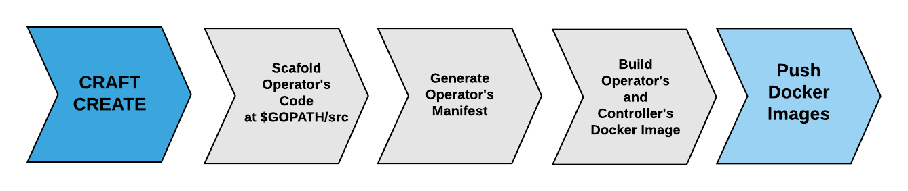

# Commands of CRAFT

## craft init
Usage :
```
craft init
``` 
Initialises a new project with sample controller.json and resource.json

## craft build
Has 3 sub commands, code, deploy and image. 

### build code
Usage:
```
craft build code -c "controller.json" -r "resource.json
```
Creates Operator's code in $GOPATH/src 

### build deploy
Usage:
```
craft build deploy -c "controller.json" -r "resource.json
```
Builds operator.yaml for deployment onto cluster.

### build image
Usage:
```
craft build image -b -c "controller.json" --podDockerFile "dockerFile"
```
Builds operator and resource docker images. 

## craft create
Usage :
```
craft create -c "controller.json" -r "resource.json --podDockerFile "dockerFile" -p
```


## validate
Usage:
```
craft validate -v "operator.yaml"
```
Validates operator.yaml to see if the CRD and operator manifest that we created is Valid for k8s's Structural schema & API

### craft version
Usage : 
```
craft version
```
Displays the information about craft, namely version, revision, build user, build date & time, go version. 
